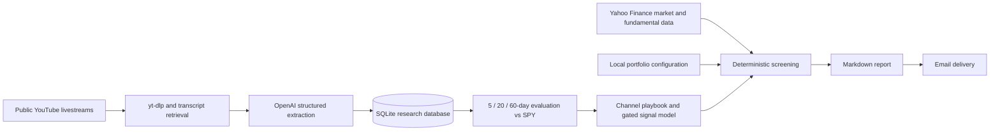

# YouTube Daily Brief

An evidence-weighted investment research pipeline that turns public YouTube livestreams into a daily portfolio brief.

The project was built as a Windows-first personal research tool. It collects completed livestreams from configurable YouTube channels, extracts structured market views with the OpenAI API, evaluates historical calls against subsequent returns, combines them with market and fundamental data, and emails a concise report for two portfolios with different time horizons.

> **Research only.** The application never signs in to a brokerage, creates orders, or executes trades.

## Why I built it

Investment livestreams contain useful observations, but they are difficult to compare over time. A confident prediction can also sound more reliable than it actually is.

This project converts those videos into a repeatable research process:

- What securities and themes did each channel discuss?
- Was the view bullish, bearish, or neutral?
- Did comparable historical calls outperform SPY after 5, 20, or 60 trading days?
- Does the current price, sector trend, valuation, or fundamental data support the claim?
- Does the idea fit the intended account and its risk limits?

## System overview



## Key features

- **Livestream-only ingestion**: analyzes completed public livestreams and skips ordinary uploads, Shorts, upcoming or active streams, private videos, and restricted content.
- **Structured research extraction**: records tickers, direction, confidence, thesis, risks, and transcript status.
- **Resumable six-month backfill**: builds a local research history without restarting completed work.
- **Forward-performance evaluation**: measures 5-, 20-, and 60-trading-day returns and SPY-relative performance.
- **Conservative reliability estimates**: applies Beta(2,2) shrinkage so small samples do not appear overly reliable.
- **Point-in-time model validation**: compares candidate models with purged, time-ordered walk-forward evaluation. A model that fails its activation gate remains experimental and cannot affect portfolio actions.
- **Independent candidate screening**: a livestream mention can discover an idea, but price trend, relative strength, valuation, fundamentals, volatility, and earnings timing determine whether it passes research screening.
- **Account-specific logic**:
  - **IBKR**: long-term, fundamental thesis and valuation focused.
  - **Robinhood**: tactical, primarily 5��60 trading days.
- **Risk controls**: 15% maximum weight for an individual stock, plus smaller initial research limits for new positions.
- **Local-first storage**: portfolio data, research history, reports, and credentials remain on the user's computer.
- **Email delivery**: produces both a local Markdown report and an SMTP email.

## Decision rules

The project intentionally separates **content discovery** from **portfolio action**.

| Situation | Rule |
|---|---|
| A livestream mentions a new ticker | Treat it as a research lead, not a buy signal |
| New candidate for IBKR | Must pass long-term fundamental and risk screening; initial research limit is 5% |
| New candidate for Robinhood | Must pass tactical trend and relative-strength screening; initial research limit is 3% |
| A channel turns bearish on an existing holding | Do not reduce solely because of the video; require independent price or fundamental confirmation |
| A stock exceeds 15% of one account | Flag it for concentration management without pretending the investment thesis deteriorated |
| A trained model fails validation | Keep it inactive and exclude its probability from recommendations |
| Data is missing | Report insufficient evidence instead of filling gaps with model memory |

## Technology

- Python 3.9 or 3.11
- OpenAI Responses API
- `yt-dlp`
- `youtube-transcript-api`
- SQLite
- `yfinance`
- scikit-learn
- Gmail or another STARTTLS-compatible SMTP provider
- Windows Task Scheduler

## Project structure

```text
youtube-daily-brief/
��鎿��� main.py                    # Daily pipeline, report generation, and email delivery
��鎿��� backfill.py                # Resumable historical livestream ingestion
��鎿��� research.py                # Transcript extraction, persistence, and backtesting
��鎿��� market_features.py         # Price, benchmark, sector, and fundamental features
��鎿��� candidate_screening.py     # Rules for newly discovered securities
��鎿��� holding_screening.py       # Rules for existing holdings
��鎿��� signal_model.py            # Walk-forward model training and activation gate
��鎿��� train_signal_model.py      # Standalone model training entry point
��鎿��� portfolio.example.json     # Sanitized portfolio configuration template
��鎿��� .env.example               # Environment-variable template
��鎿��� requirements.txt
��鎿��� setup_windows.bat
��鎿��� run.bat
��婙��� test_report_v2.py
```

## Getting started on Windows

### 1. Prerequisites

Install:

- Python 3.11 or 3.9
- Git
- An OpenAI API key with available credit
- An email account that supports SMTP; Gmail requires a Google App Password

### 2. Create the environment

Open Command Prompt or PowerShell in the project folder and run:

```powershell
.\setup_windows.bat
```

This creates `.venv`, installs the dependencies, and copies `.env.example` to `.env` when needed.

### 3. Configure `.env`

```env
# Comma-separated YouTube channel IDs; use UC... IDs, not @handles
YOUTUBE_CHANNEL_IDS=UCxxxxxxxxxxxxxxxxxxxxxx,UCyyyyyyyyyyyyyyyyyyyyyy

# OpenAI
OPENAI_API_KEY=your_openai_api_key
OPENAI_MODEL=gpt-5-mini

# Email
SMTP_HOST=smtp.gmail.com
SMTP_PORT=587
SMTP_USERNAME=your_address@gmail.com
SMTP_PASSWORD=your_google_app_password
EMAIL_FROM=your_address@gmail.com
EMAIL_TO=your_address@gmail.com

# Daily research
MAX_NEW_VIDEOS_PER_CHANNEL=1
LATEST_SIGNAL_DAYS=7

# Historical research
BACKFILL_DAYS=183
MAX_BACKFILL_VIDEOS_PER_RUN=5
BACKFILL_DELAY_MIN_SECONDS=20
BACKFILL_DELAY_MAX_SECONDS=40
```

Never commit `.env` or paste its contents into an issue.

### 4. Configure the portfolios

Copy the sanitized template, then edit the private local copy:

```powershell
Copy-Item portfolio.example.json portfolio.json
```

The resulting `portfolio.json` is ignored by Git. It uses this schema:

```json
{
  "accounts": [
    {
      "name": "IBKR",
      "strategy": "long_term_fundamental",
      "cash_usd": 5000,
      "max_single_weight": 0.15,
      "positions": {
        "AAPL": 10,
        "SPY": 5
      }
    },
    {
      "name": "Robinhood",
      "strategy": "tactical_5_to_60_trading_days",
      "cash_usd": 2000,
      "max_single_weight": 0.15,
      "positions": {
        "NVDA": 8
      }
    }
  ]
}
```

Position values are share quantities, not portfolio weights. Update this file after trades so the next report uses the current holdings and cash balance.

## Build the historical research database

Update `yt-dlp`, then start a backfill batch:

```powershell
.\update_ytdlp.bat
.\run_backfill.bat
```

Each run processes at most 10 videos even if a larger value is configured. The default is 5, with a randomized 20��40 second delay between transcript requests. Progress is persisted in `research.db`, so later runs resume where the previous run stopped.

Check progress with:

```powershell
.\check_backfill_status.bat
```

If YouTube blocks transcript requests, stop retrying and wait several hours. Rapid retries usually make the block last longer.

When the backfill is complete, the project builds `channel_playbook.json`. It can also be refreshed manually:

```powershell
.\build_playbook.bat
```

## Run the daily report

```powershell
.\run.bat
```

The pipeline will:

1. Find new completed public livestreams.
2. Extract and store structured research when readable transcripts are available.
3. Update matured historical outcomes.
4. Refresh the channel playbook or signal model when stale.
5. Load the current portfolios and independent market data.
6. Screen current holdings and newly discovered candidates.
7. Save a Markdown report under `reports/` and send it by email.

The report still runs when no new livestream is available, allowing concentration and independent market-risk checks to continue.

## Schedule it for 8:00 AM

In Windows Task Scheduler, create a daily task with:

- **Trigger**: Daily at 8:00 AM
- **Program/script**: the full path to `run.bat`
- **Start in**: the project directory
- **Run whether user is logged on or not**: optional, depending on the local setup

Run `run.bat` manually once before enabling the schedule so configuration or SMTP errors are visible.

## Testing

Run the deterministic report and screening tests with:

```powershell
.\.venv\Scripts\python.exe -m unittest test_report_v2.py
```

The current suite contains 12 tests covering report rendering, candidate limits, concentration handling, ticker normalization, and evidence requirements.

## Generated local files

These files contain private, machine-specific, or reproducible state and should not be committed:

```text
.env
.venv/
portfolio.json
research.db
channel_playbook.json
fundamentals_cache.json
market_features.db
signal_model.joblib
signal_model_report.json
delivery_state.json
state.json
logs/
reports/
```

Only `portfolio.example.json` should be committed. Removing a private file after committing it does not remove it from Git history.

The monitored channels are intentionally not hard-coded. Public repositories should keep
real channel IDs in the untracked `.env` file and use placeholders in documentation. This
makes the project reusable and avoids presenting it as an endorsement of specific creators.

## Methodology notes

- Entry measurement begins on the next trading day after publication to reduce look-ahead bias.
- Returns are evaluated after 5, 20, and 60 trading days.
- Excess return is calculated against SPY over the same period.
- Signals that have not completed their evaluation window are excluded from scoring.
- Videos without a usable transcript do not call the OpenAI API and do not create a directional signal.
- Historical channel performance changes the weight of evidence; it does not automatically reverse a bullish or bearish claim.
- Only U.S.-listed stocks and ETFs are eligible for new-candidate screening. Duplicate company exposure and invalid or unsupported tickers are filtered.

## Current limitations

- `yfinance` is a convenient research source, not an exchange-grade real-time market feed.
- Fundamental fields and earnings dates can be missing, delayed, or revised.
- Ticker extraction from natural-language transcripts is imperfect and requires validation.
- Six months of historical data is too short to establish durable forecasting skill.
- Backtests remain exposed to selection bias, regime changes, transcript availability, and publication-timestamp assumptions.
- Version 2.0.3 emphasizes deterministic actions and screening evidence. The full per-channel narrative summary, explicit agreement/disagreement section, and day-over-day change explanation are not yet surfaced in the email renderer.
- The system does not calculate taxes, transaction costs, wash sales, or brokerage-specific restrictions.

## Roadmap

- Restore concise per-stream summaries in the daily email.
- Add an explicit cross-channel consensus and disagreement section.
- Explain which current holdings were directly discussed and why the evidence matters.
- Add a �菏hat changed since yesterday�� section.
- Add sanitized sample data and end-to-end integration tests.
- Support a configurable benchmark and sector ETF mapping.

## Disclaimer

This project is for personal research and software demonstration purposes only. Its output is not personalized fiduciary advice, a solicitation, or a guarantee of future performance. Always verify market data, company filings, and earnings information independently before making an investment decision.